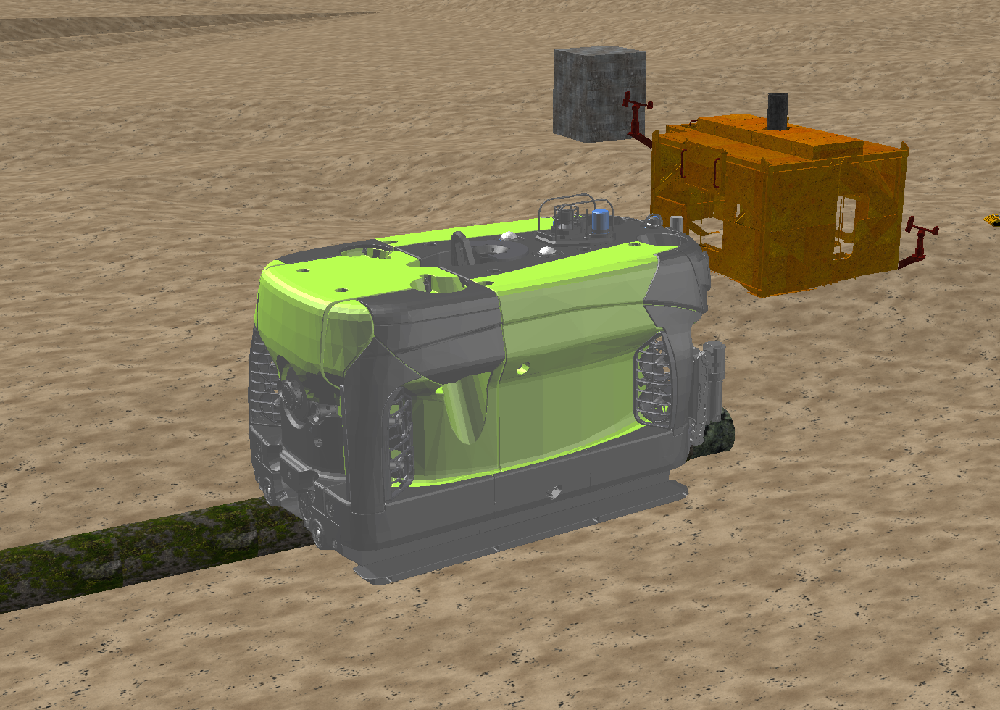
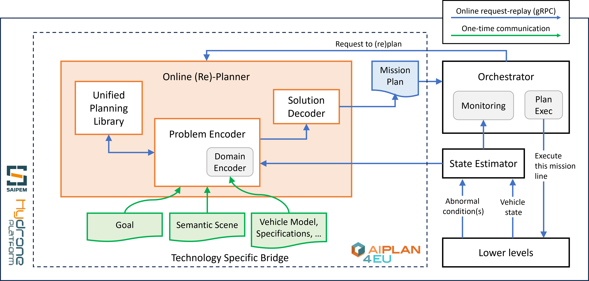

# Underwater inspection

## Context

HyDrone is a technology program to develop highly reconfigurable underwater vehicles expected to carry out underwater missions at different degrees of autonomy and to operate resident underwater without maintenance for up to two years. Most common missions include geographically restricted inspections and operations on wells, pipelines, and processing systems. They extend to medium-range tasks and further expand to long-range missions.

In this context, AI planning techniques may offer solutions to various challenges, including:

- Efficiently managing system resources even in abnormal or unexpected conditions happening during mission execution
- Effectively handling critical and abnormal situations that pose risks or potential damage
- Making the mission formulation independent from the specific field, enhancing code reusability, and facilitating the development of additional system features, not tied to a singular scenario but adaptable across various contexts.
- Exploiting opportunities that may not be considered by standard, rigid plans programmed by humans
- Help in validating missions proposed/developed by humans

## Planning Problem Description

The primary goal of this use case is the inspection and maintenance of subsea fields, structures, and infrastructures via Autonomous Underwater Vehicles. An Autonomous Underwater Vehicle, called Hydroner, has to navigate through a complex 3D map and reach an ordered set of inspection locations. While navigating, the robot should optimize resource utilization (such as time, battery charge, and data capacity). Inspection targets can be associated with ordering and priority rules. Moreover, due to the unpredictable and non-deterministic nature of the underwater operating environment, it is crucial for the robot to have replanning capabilities to adapt and adjust its path and actions in real-time due to contingencies (e.g., lack of battery) and new opportunities (new inspection points not previously considered).

## Modeling in UP

In the Unified-Planning library, we first define the robot and its resources. To this aim, we exploit different types of fluents. For example, we use user-defined fluents to represent the robot itself and boolean fluents to check if it is currently located at a certain pose on a map or has already visited a certain inspection location. Additionally, we exploit numeric fluents to represent and manage the vehicle's resources, such as battery power and storage space.

Once both the system and its resources are defined, we can construct the planning problem we want to solve: the underwater inspection of a set of possibly ordered and prioritized targets with resource consumption optimization (e.g., time, battery, data capacity). That is, a *temporal* planning problem where goals may include makespan minimization and temporal intervals within which inspection targets should be reached. We use *oversubscription* to order goals and mark them as optional, while battery consumption and data storage are numeric resources that can be constrained. In this context, we use `DurativeActions` to account for the time required to accomplish an action (e.g., moving from a start location to a goal one).
  
With the assumption that the robotic tasks under consideration cannot be executed in parallel,  we model the problem also as a *numeric* planning problem. In this case, we consider `InstantaneousActions` and time is a numeric fluent also constrained. 

## Operation Modes and Integration Aspects

Given the set of points to be inspected and the constraints imposed on the mission, we exploit `OneshotPlanning` to generate a plan. The plan optimizes resource utilization and respects the ordering and priority rules applied to the targets. The plan can be validated via `PlanValidation` to verify that it aligns with mission objectives and does not violate critical constraints, thereby enhancing the success of the mission and the safety of the underwater vehicle.

Then, we decorate the plan with checkpoints that - during execution - ask the robot to verify whether the real value of a specific resource (e.g., battery level) aligns with the estimated value provided by the checkpoint. To this aim, we use the `SequentialSimulator` to estimate the value of a certain resource at a certain point along the plan.

The decorated plan is translated into a robot-compliant format and sent to the robot for execution. While executing, if a checkpoint is violated because of a contingency (lack of battery) or a new opportunity (battery enough to add other inspection targets), the robot triggers a replan request. We consider the new initial state of the robot, the set of opportunities, and the goals already achieved, and, based on this information, we modify the current planning problem and ask the `Replanner` to find a new solution.

This software was successfully integrated into the Hydroner architecture, as shown in the following picture.

## Lessons Learned  

By exploring different experimental setups, we've gained valuable insights regarding modeling and planning. Examples include:

1.  **Importance of a simple but exhaustive model**: Formulating a simple model reduces the computational time required to plan, consequentially speeding up the planning process. In our case, being able to include only essential details is mandatory to ensure efficient replanning in case of contingencies or new opportunities.

2.  **Importance of model generalization capability**: Exploiting a generic model allows us to easily switch between durative and instantaneous actions, where time is modeled as a numerical constraint. Moreover, generality allows easy adaptation of our formulation when changing the inspection field or the robot's specifications (e.g., the battery consumption model).

3.  **Importance of planning engine selection**: The selection of an appropriate planning engine plays a crucial role in addressing the complexity of the problem. In the case of analysis, we carefully select the engine based on the constraints imposed by the problem (e.g., numeric or temporal) and its consequent modeling.

## Resources

- [Planning for Subsea page](https://www.ai4europe.eu/business-and-industry/case-studies/underwater-operations)
c
